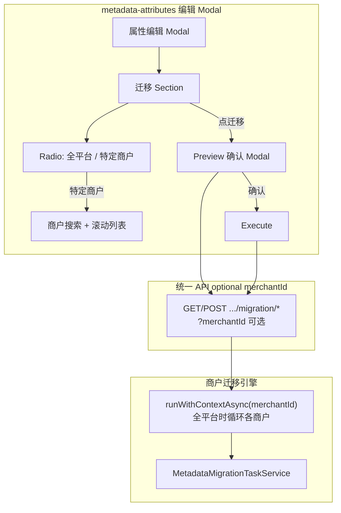

# Platform 端 Metadata 属性迁移任务 — 可行性分析与实现方案

## 结论：可行

现有商户侧已具备完整的 **属性迁移任务** 能力（CMS [`metadata-migrations.tsx`](xituan_cms/src/pages/metadata-migrations.tsx) + Backend [`metadata-migration-task.service.ts`](xituan_backend/src/domains/metadata/services/metadata-migration-task.service.ts)）。Platform 删除被阻断的原因来自 [`platform-metadata-delete-guard.util.ts`](xituan_backend/src/domains/metadata/utils/platform-metadata-delete-guard.util.ts) 的全局计数；迁移完成后依赖下降，即可删除。

| 依赖 kind | 迁移能否消除 |
|-----------|-------------|
| `PRODUCT_METADATA_VALUE` | **能** — 改写/删除 jsonb key |
| `MERCHANT_ATTRIBUTE_REF` | **能** — 需补全 `platform_attribute_id` link |
| `REPLACEMENT_KEY_REF` | **不能靠迁移消除** — 需先改 platform 模板 |



**删除 Popconfirm 不改** — 仍只显示依赖阻断与合计数；迁移入口在 **属性编辑页**。

---

## 现状与缺口（实施前需知晓）

**已有、可直接复用：**
- 任务表：`merchant.metadata_migration_task` / `_item`
- Action：`RENAME_KEY_AND_LINK`、`LINK_TO_PLATFORM`
- Enum 映射：`details.enumMap`（CMS 已有 UI 模式）

**缺口（Platform 代迁移前建议一并修）— FAQ 见下文：**

1. `RENAME_KEY_AND_LINK` 无 enumMap 时不执行 → 改为无 map 原样 copy + key 搬迁
2. `LINK_TO_PLATFORM` 不写 `platform_attribute_id` → 按 bug 修
3. 商品 UPDATE 可 SQL 批量优化，但 **无论批量或逐行，必须先 preview 再 confirm 才写库**
4. `RENAME`/`LINK` 改 jsonb 不可 rollback → preview 是安全网
5. 需 optional `merchantId` 的 impact 数据，供「特定商户」搜索列表使用（不放在删除弹窗）

---

## 缺口 FAQ（澄清）

### 1–2、4–5

（内容与上一版 FAQ 相同，见计划历史；第 5 点 breakdown 用于 **编辑页迁移 Section 的商户搜索列表**，不再用于删除 Popconfirm。）

### 3. 批量 vs 逐行 — 都必须先 Review 再确认

**对。** 执行策略（SQL 批量 / TS 逐行）只是 **写库实现**；**产品流程固定为两步**：

1. **Preview（Review）** — 只读：影响商户数、商品数、类目、enum 未映射值、样例变更摘要；**不写库**
2. **Confirm Execute** — 用户明确确认后才开始 UPDATE；全平台模式同样先出 **汇总 preview**，再确认

UI：`迁移` 按钮 → 打开 Preview Modal（或 Drawer）→ 用户点 **确认执行** 才调 execute API。批量优化不改变此流程。

---

## Platform UI（属性编辑 Modal）

入口：[`metadata-attributes.tsx`](xituan_platform/src/pages/metadata-attributes.tsx) **编辑/新建属性 Modal**（非删除 Popconfirm）。

### 布局

| 布局 | 迁移 Section 位置 |
|------|------------------|
| **宽屏双列**（`isWideModalLayout`） | 右侧 Col（`formSection="type"` 类型列）**下方** |
| **单列** | Form **最后**（replacement_key 表单项之后） |

提取为组件：`PlatformMetadataAttributeMigrationSection`（或类似命名）。

### 显示条件

| 条件 | UI |
|------|-----|
| `templateFieldStatus !== REPLACED` 或 **无 `replacementKey`** | 静态提示：「仅用于 REPLACED 属性状态，需要先设定替换 key」；无迁移控件 |
| `REPLACED` **且** `replacementKey` 有值 | 完整迁移 Section（source = 当前 `storageKey`，target = `replacementKey`，只读展示） |

> 编辑中未保存的 `replacementKey`：Section 跟随 Form watch；若尚未保存到 DB，preview/execute 前提示先 **保存属性**（或 execute 时后端读已持久化值 — 推荐 **先保存再迁移**）。

### 迁移 Section 控件

1. **Radio.Group**：`全平台` | `特定商户`
2. **特定商户** 时：
   - 商户搜索 `Input`（keyword 防抖）
   - 有限高度（如 `maxHeight: 240px`）**可滚动列表**，展示筛选结果（商户名 + 影响商品数）
   - 点击行选中（高亮）
   - **未选中商户 → 「迁移」按钮 disabled**
3. **全平台** 时：不显示搜索列表；**「迁移」按钮 enabled**
4. **「迁移」按钮** → 调 **preview API** → 打开 Preview 确认 UI（enumMap 编辑可嵌在 Section 或 Preview 内，与 CMS 对齐）
5. Preview 内 **确认执行** → execute API；展示分批进度（Phase 1）

### 删除 Popconfirm

[`platform-metadata-delete-popconfirm.tsx`](xituan_platform/src/components/platform-metadata-delete-popconfirm.tsx) **保持现状**：仅依赖检查 + 禁用删除；**不加**迁移入口。

---

## 后端 API（统一 optional `merchantId`）

挂载 `/api/admin/platform/metadata`，**不**按商户拆独立路径；相关 endpoint 用 **optional `merchantId`**（query 或 body）区分范围。

| 方法 | 路径 | `merchantId` | 行为 |
|------|------|--------------|------|
| GET | `/attributes/:id/migration/impact` | query 可选；`keyword` 可选 | **无 merchantId**：返回受影响商户列表（搜索/分页）；**有 merchantId**：该商户 impact（productCount、categoryIds、merchantAttributeRefCount） |
| GET | `/attributes/:id/migration/candidates` | query 可选 | enum/key 候选；无 merchantId 时可返回全平台聚合或按 scope 参数 |
| POST | `/attributes/:id/migration/preview` | body 可选 | **只读** preview；无 merchantId = 全平台汇总 preview |
| POST | `/attributes/:id/migration/execute` | body 可选 | 确认后执行；无 merchantId = 按商户顺序循环（每商户 `runWithContextAsync`） |

**Body 公共字段（示例）：** `{ merchantId?: string, enumMap?: Record<string,string>, categoryIds?: string[] }`

**复杂度评估：** optional `merchantId` 不显著增加 API 面 — service 层 `resolveScope(merchantId?)` 分支即可；全平台 execute 内部 = foreach merchant + 现有单商户逻辑，**preview 必须先跑** 返回 `{ merchants: [{ merchantId, productCount, unmappedValues, ... }], totalProductCount }`。

**任务溯源**（`metadata_migration_task.summary`）：

```json
{
  "initiatedBy": "PLATFORM",
  "scope": "ALL_MERCHANTS | SINGLE_MERCHANT",
  "platformOperatorUserId": "...",
  "platformAttributeId": "...",
  "merchantId": "... or null"
}
```

**默认 action：** `REPLACED` + `replacement_key` → `RENAME_KEY_AND_LINK`（source=旧 storageKey，target=replacement_key）。

---

## 执行模型

**Preview 与 Execute 分离（强制）：**

- Preview：零写库（或只读事务）
- Execute：无 map → SQL 批量 key 搬迁；有 enumMap → SQL 批量 + TS 兜底；分批返回 progress

**Phase 1 — 同步分批：** execute 单次上限（如 500 商品/商户），全平台模式下按商户 + 批次推进。

**Phase 2 — 异步 Job：** 全平台大规模时 enqueue；编辑页仍先 preview。

---

## 分阶段交付

### Phase 1（MVP）

1. Refactor migration service（缺口 1–3 + preview 路径）
2. 统一 Platform migration API（optional merchantId）
3. 属性编辑 Modal 迁移 Section + Preview 确认流
4. 删除 Popconfirm **不改**

**Gate：** REPLACED 属性 + replacement_key → 特定商户 preview → confirm → 该商户依赖下降；全平台 preview → confirm → 全局依赖归零后可 DELETE。

### Phase 2

- 全平台异步 worker、enumMap 模板、收费/consent

### 不在本方案内

- 删除 Popconfirm 迁移入口
- 无 `replacement_key` 时允许迁移
- `DEPRECATE_ONLY` 作为 Platform 删除主路径

---

## 风险与缓解

| 风险 | 缓解 |
|------|------|
| 全平台误操作 | 强制 preview + 二次确认；summary 审计 |
| enum 遗漏 | preview 列 unmappedValues；strict enum 阻断 execute |
| 大批量超时 | 分批；Phase 2 异步 |
| 编辑未保存 replacement_key | UI 提示先保存属性 |

---

## 主要改动文件（Phase 1）

| 层 | 文件 |
|----|------|
| Backend migration | [`metadata-migration-task.service.ts`](xituan_backend/src/domains/metadata/services/metadata-migration-task.service.ts) |
| Backend platform | 新 `platform-metadata-migration.service.ts` + 扩展 [`platform-metadata-admin.routes.ts`](xituan_backend/src/domains/metadata/routes/platform-metadata-admin.routes.ts) |
| Codebase types | [`metadata.type.ts`](xituan_platform/submodules/xituan_codebase/typing_entity/metadata.type.ts) — preview / impact 类型 |
| Platform UI | [`metadata-attributes.tsx`](xituan_platform/src/pages/metadata-attributes.tsx)、新 `PlatformMetadataAttributeMigrationSection`、[`platform-metadata.api.ts`](xituan_platform/src/lib/api/platform-metadata.api.ts) |

---

## Post-deploy 说明

Additive 特性；无需 post-deploy ledger。Phase 2 新表/收费再登记。
